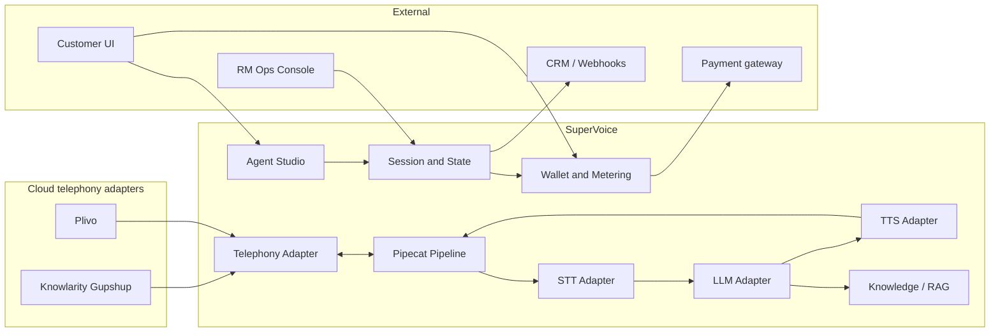

# SuperVoice — Voice Agent Platform  
## Product Requirements Document (V1)

| Field | Value |
|--------|--------|
| **Version** | 1.3 |
| **Status** | Draft for engineering & design kickoff |
| **Phase 1** | India — real estate SMB (inbound + outbound) |
| **Phase 2** | Global expansion + additional verticals |
| **Commercial model** | Prepaid wallet (INR, SMB) |
| **Owner** | Product |
| **Last updated** | September 2026 |

---

## 1. Executive summary

SuperVoice is a **configurable voice agent platform** for SMB real estate businesses. Customers **recharge a prepaid wallet** before placing or receiving AI-mediated calls. They build agents in an **agent studio** (templates plus **custom system prompts**), connect numbers via **pluggable cloud telephony**, and run **inbound** and **outbound** voice workflows. The runtime stack orchestrates **telephony**, **STT**, **LLM**, and **TTS** through interchangeable adapters, with **[Pipecat](https://github.com/pipecat-ai/pipecat)** as the real-time voice framework.

**V1 success** is measured by: wallet-funded usage without billing leakage, reliable call completion, acceptable dialogue quality, measurable lead outcomes, and the ability to **swap telephony/LLM/STT/TTS** per tenant or environment without product rework. A **human two-way calling** capability exists for **RM-approved accounts only** (not default for all tenants).

**Geography:** **Indian customers first** (numbers, compliance, payments, and GTM tuned for India). **Phase 2** adds non-India regions, multi-currency wallets, and region-specific compliance packs—without replacing the adapter-based core.

**Initial telephony (multi-vendor):** **[Knowlarity](https://www.knowlarity.com/)** (cloud telephony; **[Gupshup](https://www.gupshup.ai/)** group) as the **default for new India tenants**; **[Plivo](https://www.plivo.com/)** as a **second CPaaS adapter** for vendor choice and Phase 2 international numbering.

---

## 2. Problem statement

Indian real estate teams lose revenue and speed because:

- **Inbound**: Missed or slow response to listing inquiries, after-hours calls, and repeat “status update” questions tie up agents.
- **Outbound**: Manual dial-and-qualify for new leads, open-house follow-up, and nurture calls do not scale; consistency and compliance vary by agent.

Generic chatbots and IVRs fail on **natural dialogue**, **barge-in**, and **context** (property, budget, timeline). Building one-off integrations per STT/LLM/TTS vendor is costly and blocks experimentation.

**SuperVoice** productizes a **vendor-agnostic voice stack** and **real-estate-specific playbooks** so customers deploy agents without owning pipeline engineering.

---

## 3. Vision & product principles

| Principle | Implication for V1 |
|-----------|-------------------|
| **Conversation-first** | Optimize latency, turn-taking, and clarity over feature count. |
| **Pluggable vendors** | **Telephony, STT, LLM, and TTS** are independently swappable per tenant, region, or environment via adapter configuration. |
| **Prepaid-first (SMB)** | No usage without wallet balance; transparent metering and low-friction recharge. |
| **Self-serve agent creation** | Customers author prompts and configure agents; platform enforces guardrails and billing. |
| **Gated premium capabilities** | High-risk or high-touch features (e.g., live two-way calling) enabled only by internal RM ops. |
| **India first, global ready** | Ship for INR, IST, NDNC, and Indian telephony defaults; adapters avoid India-only forks. |
| **Vertical depth before breadth** | Indian real estate workflows, data fields, and compliance assumptions are first-class. |
| **Human handoff by design** | Agents escalate to live agents with context; never trap users. |
| **Observable & improvable** | Transcripts, outcomes, and quality signals feed iteration and customer reporting. |

**Phase 2 (global):** Expand to US/UK/Middle East and other markets—multi-currency wallet, regional telephony defaults (e.g., Plivo), and compliance packs (e.g., TCPA). Same Pipecat + adapter architecture; no forked product.

**Post–real-estate:** Additional vertical packs in India first, then global (e.g., home services, education counseling).

---

## 3.1 Geographic scope

| | Phase 1 (V1) | Phase 2 |
|---|--------------|---------|
| **Customers** | India-based SMBs | International SMBs |
| **Currency** | **INR** wallet & recharge | Multi-currency |
| **Telephony default** | Knowlarity | Region-specific default per country |
| **Numbers** | Indian virtual/mobile/toll-free per Knowlarity/Plivo India support | Local DIDs per region |
| **Compliance** | India: TRAI/NDNC-aware outbound, recording disclosure, GST on recharge | Market-specific packs |
| **Language** | English primary; **Hindi** (and Hinglish dialogue) on roadmap within Phase 1 | Additional locales |

---

## 4. Goals & non-goals

### 4.1 V1 goals

1. **Inbound agent**: Answer calls on configured numbers; handle top real-estate intents with scripted + LLM-guided dialogue; book callbacks or appointments where integrated.
2. **Outbound agent**: Place calls from lists or triggers; qualify leads and capture structured outcomes; respect retry and quiet-hour rules.
3. **Four-layer vendor flexibility**: Production paths for **telephony**, **STT**, **LLM**, and **TTS**; swap any layer without changing conversation product logic (adapter + config only).
4. **Prepaid wallet & recharge**: Account creation → recharge → enable calls/campaigns; real-time balance debit and hard stop when insufficient funds.
5. **Agent studio**: Create inbound/outbound agents via **vertical templates** and **customer-written system prompts** (with platform safety guardrails).
6. **Customer control**: Manage agents, numbers, knowledge, hours, and view usage/wallet in admin UI.
7. **India compliance baseline**: Recording disclosure, **National DND (NDNC)** / customer DND lists for outbound, calling windows (IST), audit-friendly logs; GST-ready recharge receipts (legal review).
8. **RM-gated two-way calling**: Backend-controlled entitlement for a **live calling tool** (human/agent browser or softphone bridge)—off by default.
9. **Operator-grade ops surface** (inspired by market leaders e.g. [Ringg AI](https://docs.ringg.ai/)): test calls, call history with recordings, analytics, webhooks, and **post-call structured extraction**—without sacrificing SuperVoice differentiators (prepaid wallet, adapter stack, India compliance).

### 4.2 V1 non-goals

- Full CRM replacement or deep MLS data products.
- Full visual flow builder (drag-and-drop IVR trees); V1 is **prompt + configuration + knowledge**, not arbitrary node graphs.
- Self-serve enablement of **two-way calling** for all tenants.
- Video, SMS-only bots, or email as primary channels.
- On-prem / air-gapped deployment.
- Guaranteed sub-500ms end-to-end latency (target ranges defined in NFRs; optimization is ongoing).
- **Phase 2 global** GTM, US/EU compliance certification, and non-INR billing (architecture may prepare; product not launched).
- Full **regional-language** STT/TTS for all Indian languages in V1 (English + Hindi prioritized; others phased).
- **Webcall / website embed** and **WhatsApp** agents in V1 (Phase 1.5 / Phase 2; see §8.11).
- **Zapier**-style integration marketplace in V1 (generic webhooks + one CRM first).

---

## 4.3 Competitive benchmark — useful features to adopt

*Sources: [Ringg AI platform docs](https://docs.ringg.ai/get-started/overview/platform), [assistant configuration](https://docs.ringg.ai/get-started/guides/configure-assistant), [webhooks](https://docs.ringg.ai/webhooks/initial-setup), and common voice-agent products (Vapi, Retell, Bland). Features below are **product intent for SuperVoice**; implementation remains Pipecat + adapters.*

| Capability area | Market pattern (e.g. Ringg) | SuperVoice stance |
|-----------------|----------------------------|-------------------|
| **Assistants** | Inbound / outbound / webcall types; prompt + voice + KB | V1: inbound + outbound; webcall Phase 1.5 |
| **Custom variables** | `{{callee_name}}`, CSV columns injected into prompt | **Adopt V1** — required for outbound personalization |
| **Test before launch** | Test call + test post-call analysis | **Adopt V1** |
| **Call behavior** | Max duration, silence/inactivity, VM detect, retry, noise filter | **Adopt V1** (subset P0); VM retry P1 |
| **Knowledge base** | Document/FAQ upload for RAG | Already V1 |
| **Campaigns** | CSV, schedule, concurrency | Already V1 |
| **History** | Recordings, transcripts, status/sub-status, export | **Expand V1** — rich terminal states |
| **Analytics** | Connection rate, volume, cost, outcomes | **Adopt V1** — tie cost to **wallet** |
| **Post-call analysis** | Summary, classification, key points, action items | **Adopt V1** (platform analysis) |
| **Custom analysis** | User-defined JSON fields extracted from transcript | **Adopt P1** — real estate slots |
| **Webhooks** | `call_started` … `all_processing_completed` | **Adopt P1** — consolidated event primary |
| **API + API keys** | Programmatic outbound, list agents, numbers | **Adopt P1** |
| **Workspace** | Members, roles, API key rotation | **Adopt P1** |
| **Web embed** | WebRTC widget on site | Phase 1.5 |
| **Multi-channel** | Voice + chat + WhatsApp | Phase 2 |
| **STT keyword boost** | Names, localities, project names | P2 |
| **Billing** | Per-minute platform fee | **Differentiator:** prepaid INR wallet + transparent ledger |

---

## 5. Target customers & personas

### 5.1 Primary segment (Phase 1 — India)

| Segment | Examples |
|---------|----------|
| **Brokerages & channel partners** | City/regional brokerages, franchise teams (PropTiger-style, local brands) |
| **Developers’ sales desks** | Project inquiry and site-visit scheduling |
| **Property managers / landlords** | Rental and society-adjacent leasing offices |
| **Lead-heavy teams** | Portals and aggregators’ partner ISAs (inbound + speed-to-lead outbound) |

### 5.2 Personas

| Persona | Needs | V1 touchpoints |
|---------|--------|----------------|
| **Broker / team lead** | More answered calls, booked showings, brand-safe tone | Dashboard, outcomes, handoff rules |
| **Inside sales / ISA** | Qualified leads, less phone tag | Lead scores, CRM sync, call summaries |
| **Ops / admin** | Numbers, hours, scripts, compliance, wallet | Configuration, recharge, usage, roles |
| **SuperVoice RM / ops** | Safe rollout, upsell, fraud control | Tenant flags, two-way calling enablement, credits |
| **End caller (buyer/seller/tenant)** | Fast answers, respect, easy human transfer | Voice UX, clear opt-out on outbound |

---

## 6. Use cases (Phase 1)

### 6.1 Inbound — real estate

| ID | Use case | Caller intent | Desired outcome |
|----|----------|---------------|-----------------|
| IN-1 | **Listing inquiry** | “Is 123 Oak still available? Open house?” | Answer from knowledge base; offer showing or agent callback |
| IN-2 | **Buyer qualification** | Budget, areas, pre-approval, timeline | Capture structured fields; route hot lead to human |
| IN-3 | **Seller / valuation** | “What’s my home worth?” | Set expectations; schedule valuation appointment |
| IN-4 | **Rental inquiry** | Availability, application process | Qualify; send link or schedule tour |
| IN-5 | **After-hours / overflow** | Any of above when office closed | Message capture + next-business-day callback |
| IN-6 | **Transfer to human** | “I want an agent” | Warm transfer with summary where telephony supports |

**Inbound entry**: PSTN or SIP numbers mapped to an **inbound agent profile** (persona, knowledge, hours, escalation).

### 6.2 Outbound — real estate

| ID | Use case | Trigger | Desired outcome |
|----|----------|---------|-----------------|
| OUT-1 | **New lead speed-to-lead** | CRM/web form lead | Contact in minutes; qualify; book showing |
| OUT-2 | **Open house follow-up** | Event attendee list | Interest level, objections, next step |
| OUT-3 | **Nurture / re-engagement** | Stale pipeline stage | Re-qualify; schedule call with agent |
| OUT-4 | **Appointment reminder** | Calendar event | Confirm/reschedule; reduce no-shows |
| OUT-5 | **Listing update** | Price change, new listing match | Inform; gauge interest |

**Outbound constraints (India):** Lead consent/opt-in per your legal model; **NDNC + internal DNC** suppression; max attempts per lead; calling windows in **IST** (and per-lead timezone if stored).

---

## 7. User journeys (summary)

### 7.1 Inbound (caller)

1. Dials business number → hears brief branding + recording notice (if required).
2. Agent greets; detects intent (listing vs rental vs general).
3. Agent uses **retrieval-augmented** property/office facts; asks clarifying questions.
4. Resolution: booking, callback ticket, SMS/link (if integrated), or **transfer** to human with spoken + logged summary.

### 7.2 Outbound (lead)

1. Campaign or trigger enqueues call → system checks DNC, hours, attempt count.
2. Lead answers → agent identifies org, states purpose, offers opt-out.
3. Structured dialogue per playbook; outcomes written to CRM/lead record.
4. No answer / voicemail: policy-driven retry or voicemail drop (if product policy allows).

### 7.3 Customer admin (signup → usage)

1. Sign up → verify business → **wallet balance = 0** (calls blocked).
2. **Recharge** wallet (fixed packs or custom amount per payment integration).
3. Open **Agent studio** → choose inbound or outbound → start from real-estate template or blank prompt.
4. Attach **telephony** (Indian number via **Knowlarity** default or **Plivo** where selected).
5. Publish agent → inbound/outbound runs; **meter debits wallet** per policy (e.g., per minute, per call leg, AI + carrier components).
6. Monitor calls, transcripts, outcomes; edit prompts and knowledge; recharge when low-balance alerts fire.

### 7.4 Two-way calling (entitled customers only)

1. RM enables **`two_way_calling_enabled`** on tenant (internal admin / ops console—not customer self-serve).
2. Entitled users see **Calling** in product: dial out, receive routed calls, or bridge to live conversation per product spec (parallel to AI agents).
3. Usage debits wallet under **human call** rate card; same compliance and logging as AI calls.
4. RM can revoke entitlement; UI hides capability immediately.

---

## 8. Functional requirements

### 8.1 Core platform

| ID | Requirement | Priority |
|----|-------------|----------|
| FR-1 | Real-time bidirectional voice session orchestrated via Pipecat (or equivalent pipeline abstraction) | P0 |
| FR-2 | Pluggable **telephony, STT, LLM, TTS** via adapter interface + tenant/global config | P0 |
| FR-3 | Conversation state: session ID, turn history, extracted slots | P0 |
| FR-4 | Barge-in / interruption handling (user can speak over agent) | P0 |
| FR-5 | Graceful session end: hang-up, transfer, or callback scheduled | P0 |
| FR-6 | Post-call artifact: transcript, summary, structured outcome JSON | P0 |
| FR-7 | Webhooks or API for outcome delivery to customer systems | P1 |
| FR-8 | Multi-tenant isolation (data, config, API keys) | P0 |

### 8.2 Telephony (multi-vendor)

| ID | Requirement | Priority |
|----|-------------|----------|
| FR-T1 | **Telephony adapter layer**: unified model for answer, dial, hang-up, transfer, webhooks, media stream | P0 |
| FR-T2 | **V1 providers**: **Knowlarity (Gupshup)** + **Plivo** behind the same adapter contracts | P0 |
| FR-T3 | Per-tenant or per-number **provider selection**; **default Knowlarity** for `country=IN` new tenants | P0 |
| FR-T4 | Inbound PSTN/SIP; outbound E.164 normalization | P0 |
| FR-T5 | Call recording on/off per tenant; storage with retention policy | P0 |
| FR-T6 | Warm/cold transfer to configured PSTN destination | P1 |
| FR-T7 | AMD for outbound — configurable | P2 |

### 8.3 Prepaid wallet & billing

| ID | Requirement | Priority |
|----|-------------|----------|
| FR-W1 | **Wallet** per tenant: balance, currency, transaction ledger (credit/debit) | P0 |
| FR-W2 | **Recharge** via India payment gateway (**UPI**, cards, net banking); INR only in Phase 1; minimum top-up configurable | P0 |
| FR-W3 | **Hard gate**: inbound AI answer, outbound dial, and entitled two-way calls **blocked** when balance ≤ threshold | P0 |
| FR-W4 | **Metering**: debit on usage events (define rate card: AI minute, telephony minute, STT/LLM/TTS pass-through or bundled minute) | P0 |
| FR-W5 | Low-balance email/in-app alerts; optional auto-pause campaigns | P1 |
| FR-W6 | RM/admin: manual credit, promo credit, refund adjustment with audit trail | P1 |
| FR-W7 | Tax invoice/receipt for recharges (**GST** fields — legal + CA review) | P1 |

### 8.4 Agent studio (build your agent)

| ID | Requirement | Priority |
|----|-------------|----------|
| FR-A1 | Agent types: **Inbound**, **Outbound** (campaign-bound) | P0 |
| FR-A2 | **Custom system prompt** editor (customer-authored) with character limits and save/version history | P0 |
| FR-A3 | Real-estate **starter templates** (injectable into prompt or sidecar instructions) | P0 |
| FR-A4 | Platform **guardrails** layer: mandatory compliance snippets, blocked topics, PII handling policy | P0 |
| FR-A5 | Knowledge base: FAQ + optional listing snippets (upload V1) | P0 |
| FR-A6 | Business hours and holiday calendar | P0 |
| FR-A7 | Per-agent **model stack selection** where product exposes it (LLM, STT, TTS, voice ID) within allowed catalog | P1 |
| FR-A8 | Escalation rules (keywords, explicit “human”, optional sentiment) | P1 |
| FR-A9 | **Test call** from studio (free allowance or debited per policy) before publish | P0 |
| FR-A10 | **Custom variables** in prompt (define names; map from CSV/API/contact fields) | P0 |
| FR-A11 | **Primary + secondary language** per agent (e.g. English + Hindi) | P1 |
| FR-A12 | **Keyword boosting** list for STT (project names, localities, developer names) | P2 |
| FR-A13 | Publish/version: draft vs published agent; `agent_id` for API/webhooks | P1 |

### 8.4b Call behavior & audio (per agent)

| ID | Requirement | Priority |
|----|-------------|----------|
| FR-CB1 | **Maximum call duration** (hard cap) | P0 |
| FR-CB2 | **Inactivity / silence handling** (prompt user, then end or offer callback) | P0 |
| FR-CB3 | **Timezone** for scheduling and reporting (default **IST** for IN tenants) | P0 |
| FR-CB4 | **Noise filtering** on inbound audio (configurable) | P1 |
| FR-CB5 | **Voicemail detection (AMD)** on outbound | P1 |
| FR-CB6 | Optional **voicemail message** + **retry** policy when VM detected | P2 |
| FR-CB7 | **Turn-taking controls**: optional “no barge-in during opening line”; standard barge-in elsewhere | P1 |
| FR-CB8 | **Graceful exit warning** before hang-up on long calls | P2 |
| FR-CB9 | Optional **background office ambience** (subtle, off by default) | P2 |

### 8.5 Two-way calling (RM-gated)

| ID | Requirement | Priority |
|----|-------------|----------|
| FR-C1 | Tenant flag **`two_way_calling_enabled`** set only via **internal RM/ops admin** (not customer settings) | P0 |
| FR-C2 | Calling UI/module visible only when flag is true | P0 |
| FR-C3 | Outbound/inbound **human** calls via configured telephony adapter; wallet metering applies | P1 |
| FR-C4 | Audit log: who enabled/disabled, when, for which tenant | P0 |

### 8.6 Outbound campaign

| ID | Requirement | Priority |
|----|-------------|----------|
| FR-O1 | Import leads via CSV/API (phone, name, metadata) | P0 |
| FR-O2 | Campaign schedule: timezone-aware windows, concurrency limits | P0 |
| FR-O3 | Per-lead attempt caps and cooldown | P0 |
| FR-O4 | Global and per-campaign DNC suppression | P0 |
| FR-O5 | Real-time campaign metrics (dialed, connected, outcomes) | P1 |

### 8.7 Admin & reporting

| ID | Requirement | Priority |
|----|-------------|----------|
| FR-R1 | Call list with filters (date, agent, outcome, direction, AI vs human two-way) | P0 |
| FR-R2 | Transcript viewer + AI summary | P0 |
| FR-R3 | Wallet ledger + usage breakdown export (CSV) | P0 |
| FR-R4 | Export calls (CSV) for date range | P1 |
| FR-R5 | Role-based access: Admin, Viewer (customer); RM/Ops (internal) | P1 |
| FR-R6 | Internal console: tenant search, entitlements, wallet adjustments | P1 |
| FR-R7 | **Analytics dashboard**: call volume, connection rate, avg duration, outcome breakdown, **wallet spend** | P1 |
| FR-R8 | Call **status + sub-status** (connected, busy, no-answer, failed, not-called, error) in History | P0 |
| FR-R9 | **Recording playback** in History with transcript sync | P0 |

### 8.8 Post-call intelligence

| ID | Requirement | Priority |
|----|-------------|----------|
| FR-P1 | **Platform analysis** after each connected call: summary, intent/category, key points, suggested next actions | P0 |
| FR-P2 | **Custom analysis schema** per agent (boolean/string fields; e.g. `interested`, `budget_range`, `objection`) | P1 |
| FR-P3 | **Test analysis** on sample transcript before go-live | P1 |
| FR-P4 | Store **disconnect reason** (user hangup, agent hangup, timeout, transfer) | P0 |
| FR-P5 | **Callback requested** timestamp when captured in conversation | P1 |

### 8.9 Developer API & webhooks

| ID | Requirement | Priority |
|----|-------------|----------|
| FR-D1 | Workspace **API keys** (create, rotate, revoke) | P1 |
| FR-D2 | REST API: list agents, trigger **single outbound** call, query call by id | P1 |
| FR-D3 | **Webhooks** per agent: subscribe to events; HTTPS callback URL | P1 |
| FR-D4 | Event types (minimum): `call_started`, `call_completed`, `recording_ready`, `analysis_completed`, **`all_processing_completed`** (single payload with transcript + recording URL + analyses) | P1 |
| FR-D5 | Webhook delivery: retries, **idempotency** on `call_id` + `event_type`, receiver must return 2xx &lt; 30s | P1 |
| FR-D6 | Optional webhook **signature / shared secret** header for verification | P1 |

### 8.10 Workspace & collaboration

| ID | Requirement | Priority |
|----|-------------|----------|
| FR-WS1 | Invite **workspace members** (email); roles Admin / Member / Viewer | P1 |
| FR-WS2 | Assistant list: **search**, filter by inbound / outbound / (future webcall) | P1 |
| FR-WS3 | Per-assistant call count on list view | P2 |

### 8.11 Webcall & embed (Phase 1.5 / Phase 2)

| ID | Requirement | Priority |
|----|-------------|----------|
| FR-WC1 | **Webcall** agent type: browser WebRTC session (no PSTN) | P2 (Phase 1.5) |
| FR-WC2 | Embeddable **website widget** (script snippet, branding, CSP guidance) | P2 (Phase 1.5) |
| FR-WC3 | Webcall-specific: max session length, idle warning, idle end | P2 |
| FR-WC4 | **WhatsApp / chat** same “brain” as voice | Phase 2 |

### 8.12 Integrations

| Integration | Scope | Priority |
|-------------|--------|----------|
| **CRM** | One primary CRM OR generic webhook | P1 |
| **Zapier / Make** | Via webhooks first; native Zapier app | P2 |
| **Calendar** | Showing booking | P2 |
| **SMS** | Post-call link (listing, payment) | P2 |
| **BYO telephony** | Connect customer CPaaS credentials (advanced) | Phase 2 |

---

## 9. Non-functional requirements

| Category | Target (V1) | Notes |
|----------|-------------|--------|
| **Availability** | 99.5% platform API; voice path best-effort tied to carriers | Exclude customer carrier outages |
| **Latency** | User-perceived response: aim **&lt; 1.5s** median turn (STT end → TTS start); document p95 | Depends on vendor and region |
| **Concurrency** | Support pilot: **20 simultaneous calls**; architecture path to 200+ | Per-tenant limits configurable |
| **Security** | TLS everywhere; secrets in vault; tenant data encryption at rest | SOC2 path later |
| **Privacy** | Retention defaults (e.g., 90-day recordings); deletion on request | Configurable per contract |
| **Compliance** | India: NDNC/DND, TRAI-oriented outbound practices, recording disclosure; Phase 2: TCPA etc. | Legal review (India counsel V1) |

---

## 10. Technical approach (product-facing)

### 10.1 Reference architecture

### 10.2 Pipecat role

- **Transport**: WebRTC or telephony bridge into Pipecat audio frames.
- **Processors**: VAD, STT streaming, context aggregation, LLM function calls, TTS streaming.
- **Framework boundary**: Business logic (real estate slots, compliance checks) lives in **application services**, not inside vendor SDKs.

### 10.3 Vendor strategy (initial)

| Layer | V1 approach | Rationale |
|-------|-------------|-----------|
| **Telephony** | **Knowlarity** (India default) + **Plivo** (alternate & Phase 2 global)—same adapter contract | Knowlarity: IN virtual numbers, IVR heritage; Plivo: international scale |
| **STT** | Catalog of 2+ providers behind adapter | Cost and accuracy experiments |
| **LLM** | Catalog of 2+ models/providers behind adapter | Latency vs quality; customer choice within guardrails |
| **TTS** | Catalog of 2+ voices/providers behind adapter | Brand and locale |

**Product requirement**: Changing telephony, STT, LLM, or TTS for a tenant (or default) is a **configuration change**, not an application rewrite. Adapters implement: connect media, signaling webhooks, error taxonomy, and cost attribution hooks for wallet metering.

### 10.4 Adapter responsibilities (summary)

| Adapter | Must abstract |
|---------|----------------|
| **Telephony** | Numbers, inbound webhook, outbound API, media stream to Pipecat, transfer, hang-up, CDR fields |
| **STT** | Streaming audio in → partial/final text; language; vendor cost units |
| **LLM** | Chat/completions with tools; token usage |
| **TTS** | Text → audio stream; voice ID |

---

## 11. Conversation & data model (real estate pack)

### 11.1 Structured slots (examples)

| Slot | Inbound | Outbound |
|------|---------|----------|
| Intent | listing / buy / sell / rent / other | campaign-specific |
| Property or area interest | ✓ | ✓ |
| Budget range | ✓ | ✓ |
| Pre-approved / financing | ✓ | ✓ |
| Timeline | ✓ | ✓ |
| Contact preference | ✓ | ✓ |
| Opt-out (outbound) | — | ✓ required |
| Outcome | qualified / nurture / not interested / callback / transferred | same |

### 11.2 Guardrails

- No guaranteed investment returns or legal advice; deflect to licensed professional.
- No discriminatory steering; fair housing–aware prompt pack (legal review).
- Outbound must honor **immediate opt-out** and log suppression.

---

## 12. Success metrics

### 12.1 Product KPIs (pilot)

| Metric | Inbound | Outbound |
|--------|---------|----------|
| **Call completion rate** | % not abandoned in first 30s | % connected conversations |
| **Intent resolution** | % without human (if goal) or % successful transfer | % qualified or appointment set |
| **Time to first response** | Ring to agent speech | Lead created → first dial |
| **CSAT / thumbs** | Post-call optional | Same |
| **Cost per conversation** | All-in vendor + infra | Per connected lead |

### 12.2 Engineering KPIs

- p50/p95 turn latency; STT WER sampling; LLM token cost per minute of talk.
- Error rate: failed sessions, transfer failures, webhook delivery.

### 12.3 Business KPIs

- Pilot customers live; paid seats or usage-based revenue.
- Referenceable case study (e.g., +X% answered inbound or +Y% appointments from outbound).

---

## 13. Release phasing (recommended)

| Milestone | Scope | Exit criteria |
|-----------|--------|----------------|
| **M0 — Foundation** | Pipecat loop; telephony adapter v1 (**Knowlarity** OR **Plivo**—eng picks build order); one STT/LLM/TTS each | Lab call on Indian number; 10 min stable |
| **M0b — Telephony #2** | Second adapter (**Plivo** or **Knowlarity**, whichever not in M0) | Same test suite passes on both |
| **M1 — Wallet + studio** | Recharge, hard gate, prompt-based agent create, sandbox call | Cannot call with $0 balance |
| **M2 — Inbound beta** | PSTN inbound, IN-1/IN-2, transcripts, hours | 1 design partner live on prepaid |
| **M3 — Outbound alpha** | OUT-1, DNC, campaign window, metering | 100 calls; ledger reconciles |
| **M4 — V1 GA** | IN + OUT, History (recordings + statuses), platform post-call analysis, analytics, CRM/webhook, RM console | 3 paying SMB teams |
| **M4b — Integrations** | API keys, outbound API, webhooks (`all_processing_completed`), custom analysis | 1 partner integration live |
| **M5 — Two-way calling** | RM-gated calling tool + audit | Pilot on 2–3 entitled tenants |
| **M6 — Webcall** | WebRTC agent + embed widget | 1 customer on site widget |

---

## 14. Risks & mitigations

| Risk | Impact | Mitigation |
|------|--------|------------|
| Latency hurts UX | Abandonment | Vendor tuning, shorter replies, streaming TTS |
| LLM hallucination on facts | Wrong listing info | RAG-only for facts; “I don’t know” + human offer |
| India telecom / DND violations | Legal exposure + carrier blocks | NDNC scrubbing, opt-out, India counsel; RM review for outbound-heavy tenants |
| Phase 2 compliance drift | Global launch delay | Adapter-based compliance packs; don’t hard-code India-only in core |
| Carrier quality | Dropped calls | Multi-telephony adapters; per-tenant routing |
| Wallet leakage / negative balance | Revenue loss | Pre-auth or synchronous debit; idempotent usage events |
| Prompt injection / unsafe agent behavior | Brand/reputation | Guardrails layer + template review for new tenants |
| Two-way calling abuse / compliance | Regulatory exposure | RM-only enablement; higher rate card; monitoring |
| Scope creep (all verticals) | Delayed V1 | Strict phase gate; real estate pack only |

---

## 15. Open questions (decision log)

| # | Question | Owner | Due |
|---|----------|--------|-----|
| OQ-1 | Knowlarity API surface for **AI media streaming** (vs classic IVR) — validate with vendor | Eng | M0 |
| OQ-2 | M0 first adapter: **Knowlarity** vs **Plivo** (build order only; both required by M0b) | Eng | M0 |
| OQ-3 | Wallet rate card: bundled **AI minute** vs itemized (carrier + STT + LLM + TTS) in INR | Product + Finance | M1 |
| OQ-4 | Payment gateway (Razorpay/Cashfree/etc.) and minimum recharge (e.g., ₹499) | Product + Finance | M1 |
| OQ-9 | Hindi STT/TTS in V1 GA or Phase 1.5? | Product | M2 |
| OQ-5 | Which CRM is the first native integration? | Product + Sales | M2 |
| OQ-6 | Recording default on/off for pilots? | Legal + Product | M2 |
| OQ-7 | Two-way calling: WebRTC client vs click-to-call PSTN bridge | Eng + Product | M5 |
| OQ-8 | Customer-visible stack picker (LLM/STT/TTS) in V1 or platform-default only? | Product | M2 |
| OQ-10 | Free test calls per month vs always wallet-debited? | Product | M1 |
| OQ-11 | Which webhook events beyond `all_processing_completed` for V1? | Eng | M4b |

---

## 16. Appendix

### 16.1 Glossary

- **STT**: Speech-to-text  
- **TTS**: Text-to-speech  
- **ISA**: Inside sales agent  
- **AMD**: Answering machine detection  
- **RAG**: Retrieval-augmented generation  
- **RM**: Relationship manager (internal SuperVoice ops/sales)  
- **CPaaS**: Communications platform as a service (e.g., Knowlarity, Plivo)  
- **NDNC**: National Do Not Call registry (India)  
- **TRAI**: Telecom Regulatory Authority of India  

### 16.2 Related documents (to create)

- Technical Design Document (TDD) — Pipecat pipeline, **four adapter families**, deployment  
- Telephony Adapter Spec — **Knowlarity (Gupshup)** + **Plivo** parity checklist  
- India Compliance Brief — NDNC, recording, outbound consent, GST on prepaid  
- Wallet & Metering Spec — events, idempotency, rate card  
- Real Estate Playbook — prompts, slots, sample dialogues per use case ID  
- Security & Compliance Brief — India V1; Phase 2 addendum (TCPA, GDPR, etc.)  
- GTM — ICP, recharge packs, pilot success plan  
- Competitive UX Notes — Ringg dashboard flows mapped to SuperVoice screens  

### 16.3 Reference — Ringg dashboard modules (for design)

| Module | SuperVoice equivalent (planned) |
|--------|----------------------------------|
| Assistants | Agent studio |
| Campaigns | Outbound campaigns |
| Knowledge Base | Knowledge / documents |
| Numbers | Telephony / numbers |
| History | Call history |
| Analytics | Analytics + wallet spend |
| Workspace Members | Team settings |
| API Key | Developer settings |
| Integrations | Integrations + webhooks |

---

*End of PRD V1*
